# 3. Responsive design and Media Queries

<목차>

(1) [Responsive Web Design](#1-responsive-web-designhttpswwww3schoolscomcsscssrwdintroasp)

(2) [Learn Responsive Design]

(3) [Introduction To Responsive Web Design]

---

### (1) [Responsive Web Design](https://www.w3schools.com/css/css_rwd_intro.asp)

**Responsive Web Design - Introduction**

- Responsive Web Design - Introduction
  - 반응형 웹 디자인은 웹 페이지를 모든 장치에서 보기 좋게 함
  - 반응형 웹 디자인은 HTML과 CSS만 사용
  - 반응형 웹 디자인은 프로그램이나 JavaScript가 아님
- Designing For The Best Experience For All Users
  - 웹 페이지는 데스크탑, 태블릿 및 휴대폰과 같은 다양한 장치를 사용하여 볼 수 있으며,. 웹 페이지는 기기에 관계없이 보기 좋고 사용하기 쉬워야 함
  - 웹 페이지는 더 작은 장치에 맞게 정보를 생략해서는 안 되며, 모든 장치에 맞게 콘텐츠를 조정해야 함
    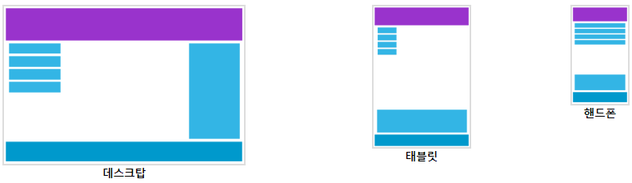
  - CSS와 HTML을 사용하여 어떤 화면에서든 잘 보이도록 콘텐츠의 크기를 조정, 숨기기, 축소, 확대 또는 이동할 때 반응형 웹 디자인이라고 함

**Responsive Web Design - The Viewport**

- What is The Viewport?
  - Viewport는 웹 페이지에서 사용자가 볼 수 있는 영역
  - 표시 영역은 장치에 따라 다르며 컴퓨터 화면보다 휴대 전화에서 더 작음
  - 태블릿과 휴대폰 이전에는 웹페이지가 컴퓨터 화면용으로만 디자인되었고, 웹페이지는 정적인 디자인과 고정된 크기를 갖는 것이 일반적이었고, 태블릿과 휴대폰을 사용하여 인터넷을 시작했을 때 고정 크기의 웹 페이지가 너무 커서 표시 영역에 맞지 않았음을 해결하기 위해 해당 장치의 브라우저는 전체 웹 페이지를 화면에 맞게 축소
- Setting The Viewport
  - `<meta>`는 HTML5는 웹 디자이너가 태그 를 통해 Viewport를 제어할 수 있는 방법을 도입
  - 모든 웹 페이지에 다음 `<meta>` Viewport 요소를 포함해야 함
    `<meta name="viewport" content="width=device-width, initial-scale=1.0">`
  - 페이지의 크기와 배율을 제어하는 ​​방법에 대한 브라우저 지침
  - `width=device-width` 장치의 화면 너비를 따르도록 페이지 너비를 설정(장치에 따라 다름)
  - `initial-scale=1.0` 부분은 브라우저에서 페이지를 처음 로드할 때 초기 확대/축소 수준을 설정
  - 다음은 Viewport `<meta>` 태그가 없는 웹 페이지 와 Viewport `<meta>` 태그가 있는 동일한 웹 페이지 의 예
    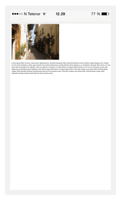
    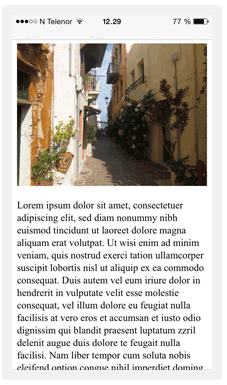
- Size Content to The Viewport
  - 사용자는 데스크톱과 모바일 장치 모두에서 웹사이트를 세로로 스크롤하는 데 사용되지만 가로는 안됨
  - 따라서 사용자가 전체 웹 페이지를 보기 위해 가로로 스크롤하거나 축소해야 하는 경우 UI가 좋지 않음
  - 따라야 할 몇 가지 추가 규칙 :
    1. 큰 고정 너비 요소를 사용하지 않기
       - 예를 들어 이미지가 뷰포트보다 넓은 너비로 표시되면 뷰포트가 수평으로 스크롤될 수 있음
       - 이 콘텐츠를 Viewport 너비에 맞게 조정
    2. 콘텐츠가 잘 렌더링되기 위해 특정 뷰포트 너비에 의존하지 않도록 하기
       - CSS 픽셀의 화면 크기와 너비는 장치마다 크게 다르기 때문에 콘텐츠는 잘 렌더링되기 위해 특정 Viewport 너비에 의존해서는 안됨
    3. CSS 미디어 쿼리를 사용하여 작은 화면과 큰 화면에 서로 다른 스타일 적용
       - 페이지 요소에 대해 큰 절대 CSS 너비를 설정하면 작은 장치의 Viewport에 비해 요소가 너무 넓어짐
       - 대신 너비: 100%와 같은 상대적 너비 값을 사용하는 것이 좋음
       - 또한 큰 절대 위치 값을 사용하는 데 주의해야하는데 작은 장치에서 요소가 Viewport 외부로 떨어질 수 있음

**Responsive Web Design - Grid-View**

- What is a Grid-View?
  - 많은 웹 페이지는 Grid-View를 기반
  - 즉, 페이지가 열로 나뉨
  - Grid-View를 사용하면 웹 페이지를 디자인할 때 매우 유용
  - 페이지에 요소를 더 쉽게 배
  - 반응형 Grid-View에는 종종 12개의 열이 있고 전체 너비가 100%이며 브라우저 창의 크기를 조정하면 축소 및 확장
    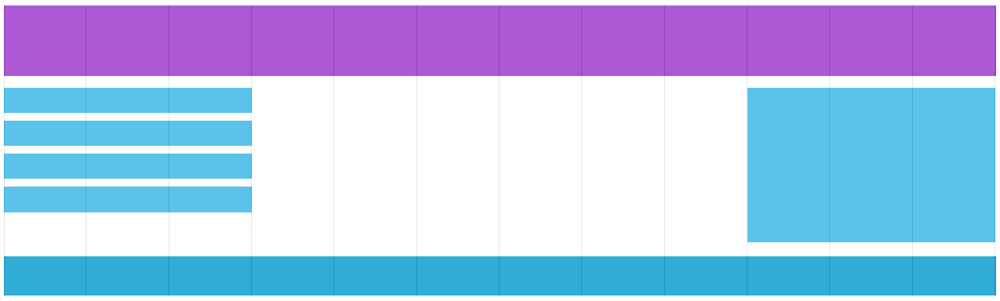

**Responsive Web Design - Media Queries**

- What is a Media Query?
  - 미디어 쿼리는 CSS3에 도입된 CSS 기술
  - `@media`특정 조건이 true인 경우에만 CSS 속성 블록을 포함하는 규칙을 사용
  ```
  # 브라우저 창이 600px 이하인 경우 배경색은 lightblue가 됨
  @media only screen and (max-width: 600px) {
      body {
          background-color: lightblue;
      }
  }
  ```
- Add a Breakpoint
  - 특정 부분이 중단점의 양쪽에서 다르게 작동하는 Breakpoint 추가 가능
- Always Design for Mobile First
  - Mobile First는 데스크톱 또는 기타 장치용으로 디자인하기 전에 모바일용으로 디자인하는 것을 의미(이렇게 하면 더 작은 장치에서 페이지 표시가 더 빨라짐).
  - 이것은 CSS에서 약간의 변경을 해야 한다는 것을 의미
  - 너비가 768px보다 작아 지면 스타일을 변경하는 대신 너비가 768px보다 커질 때 디자인을 변경
- Another Breakpoint
  - 원하는 만큼 중단점을 추가 가능
    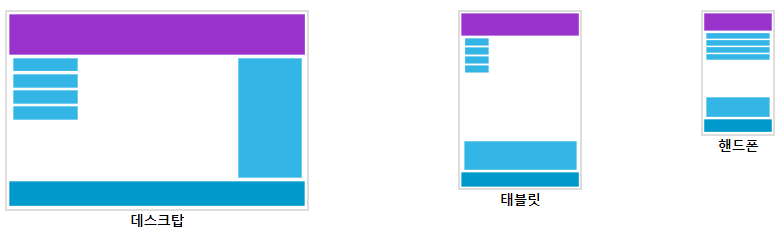
- Orientation: Portrait / Landscape
  - Media Query를 사용하여 브라우저의 방향에 따라 페이지 레이아웃을 변경 가능
  - 브라우저 창이 높이보다 넓을 때만 적용되는 CSS 속성 집합을 가질 수 있음, 이를 "Landscape" 방향
- Hide Elements With Media Queries
  - Media Query의 또 다른 일반적인 용도는 다양한 화면 크기에서 요소를 숨길 수 있음
  ```
  /* 작은 화면에서 요소가 숨겨짐 */
  @media only screen and (max-width: 600px) {
      div.example {
          display: none;
      }
  }
  ```
- Change Font Size With Media Queries

  - Media Query를 사용하여 다양한 화면 크기에서 요소의 글꼴 크기를 변경 가능

  ```
  /* 화면 크기가 601px 이상일 때 <div>의 글골 크기가 80px */
  @media only screen and (min-width: 601px) {
    div.example {
      font-size: 80px;
    }
  }

  /* 화면 크기가 600px 이하일 때 <div>의 글골 크기가 30px */
  @media only screen and (max-width: 600px) {
    div.example {
      font-size: 30px;
    }
  }
  ```

**Responsive Web Design - Images**

- Using The width Property
  - `width`속성이 백분율로 설정되고 속성 `height`이 "auto"으로 설정되면 이미지가 반응하고 확대 및 축소
  ```
  img {
      width: 100%;
      height: auto;
  }
  ```
  - 이미지는 원래 크기보다 크게 확대 가능
- Using The max-width Property
  - 속성이 100%로 설정된 경우 max-width 이미지는 필요한 경우 축소되지만 원래 크기보다 크게 확대되지 않음
  ```
  img {
      max-width: 100%;
      height: auto;
  }
  ```
- Background Images
  - 배경 이미지는 크기 조정 및 크기 조정에 응답 가능
  - 세 가지 다른 방법
    1. `background-size` 속성이 "contain"으로 설정되어 있으면 배경 이미지가 조정되고 콘텐츠 영역에 맞게 조정, 그러나 이미지는 종횡비(이미지의 너비와 높이 사이의 비례 관계)를 유지
       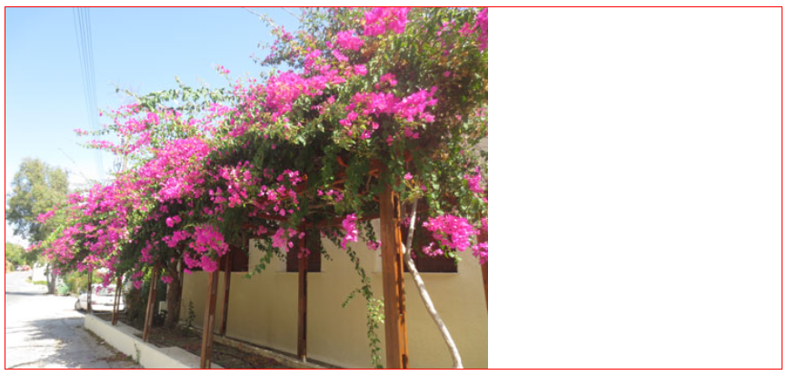
    ```
    div {
        width: 100%;
        height: 400px;
        background-image: url('img_flowers.jpg');
        background-repeat: no-repeat;
        background-size: contain;
        border: 1px solid red;
    }
    ```
    2. `background-size` 속성이 "100% 100%"로 설정되면 배경 이미지가 전체 콘텐츠 영역을 덮도록 늘어남
       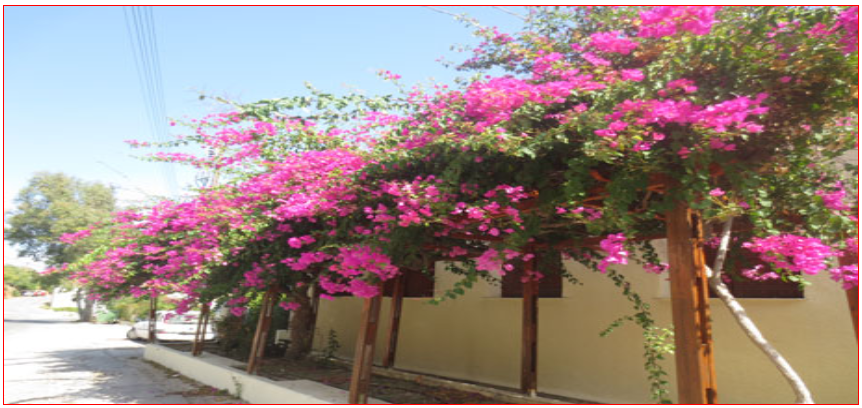
    ```
    div {
        width: 100%;
        height: 400px;
        background-image: url('img_flowers.jpg');
        background-size: 100% 100%;
        border: 1px solid red;
    }
    ```
    3. `background-size` 속성이 "cover"로 설정되어 있으면 배경 이미지가 전체 콘텐츠 영역을 덮도록 크기가 조정, "cover" 값은 가로와 세로비를 유지하고 배경 이미지의 일부가 잘릴 수 있음
       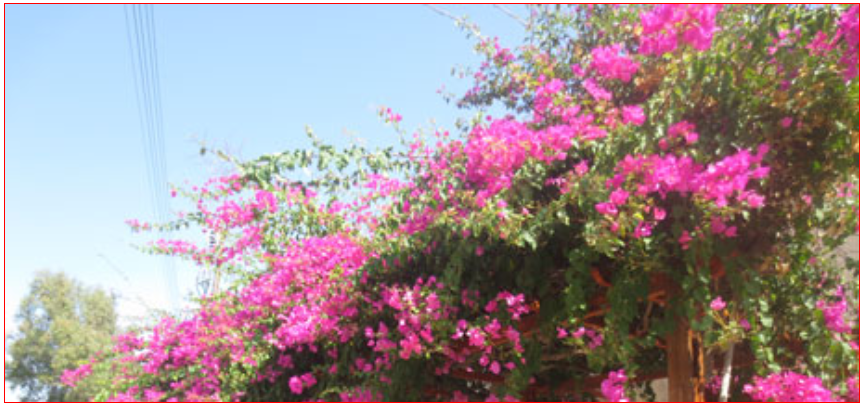
    ```
    div {
        width: 100%;
        height: 400px;
        background-image: url('img_flowers.jpg');
        background-size: cover;
        border: 1px solid red;
    }
    ```
- Different Images for Different Devices
  - 부하를 줄이기 위해 또는 다른 이유로 Media Query를 사용하여 다른 장치에서 다른 이미지를 표시
  - 브라우저 너비 대신 장치 너비를 확인하는 `min-device-width` 대신 Media Query를 사용 가능, `min-width`는 브라우저 창의 크기를 조정할 때 이미지가 변경되지 않음
- The HTML `<picture>` Element
  - HTML `<picture>` 요소를 사용하면 웹 개발자가 이미지 리소스를 보다 유연하게 지정 가능
  - 반응형 디자인에 사용되는 이미지에 사용
  - viewPort 너비에 따라 확대 또는 축소되는 하나의 이미지를 갖는 대신 브라우저 뷰포트를 더 멋지게 채우도록 여러 이미지를 디자인 가능
  ```
  <picture>
      <source srcset="img_smallflower.jpg" media="(max-width: 400px)">
      <source srcset="img_flowers.jpg">
      
  </picture>
  ```

**Responsive Web Design - Videos**

- Using The width Property
  - 속성이 100%로 설정 되면 비디오 플레이어가 반응하고 확장 및 축소
  ```
  video {
      width: 100%;
      height: auto;
  }
  ```
- Using The max-width Property
  - `max-width`의 속성이 100%로 설정된 경우 비디오 플레이어는 필요한 경우 축소되지만 원래 크기보다 크게 확대되지는 않음
  ```
  video {
      max-width: 100%;
      height: auto;
  }
  ```

**Responsive Web Design - Frameworks**

- Using W3.CSS

```
<!DOCTYPE html>
<html>
  <meta name="viewport" content="width=device-width, initial-scale=1" />
  <link rel="stylesheet" href="https://www.w3schools.com/w3css/4/w3.css" />
  <body>
    <div class="w3-container w3-blue">
      <h1>W3Schools Demo</h1>
      <p>Resize this responsive page!</p>
    </div>

    <div class="w3-row-padding">
      <div class="w3-third">
        <h2>London</h2>
        <p>London is the capital city of England.</p>
        <p>
          It is the most populous city in the United Kingdom, with a
          metropolitan area of over 13 million inhabitants.
        </p>
      </div>

      <div class="w3-third">
        <h2>Paris</h2>
        <p>Paris is the capital of France.</p>
        <p>
          The Paris area is one of the largest population centers in Europe,
          with more than 12 million inhabitants.
        </p>
      </div>

      <div class="w3-third">
        <h2>Tokyo</h2>
        <p>Tokyo is the capital of Japan.</p>
        <p>
          It is the center of the Greater Tokyo Area, and the most populous
          metropolitan area in the world.
        </p>
      </div>
    </div>
  </body>
</html>
```

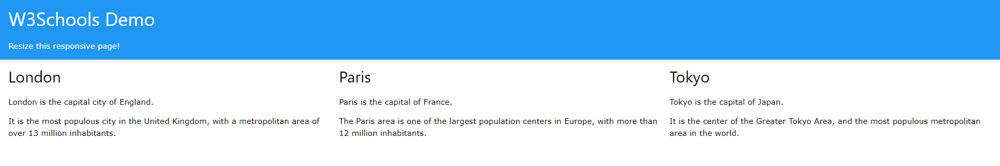

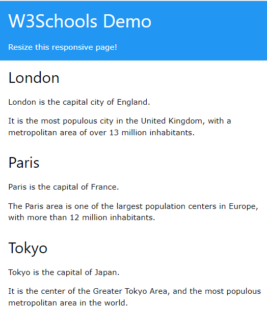

- Bootstrap

```
<!DOCTYPE html>
<html lang="en">
  <head>
    <title>Bootstrap 5 Example</title>
    <meta charset="utf-8" />
    <meta name="viewport" content="width=device-width, initial-scale=1" />
    <link
      href="https://cdn.jsdelivr.net/npm/bootstrap@5.1.3/dist/css/bootstrap.min.css"
      rel="stylesheet"
    />
    <script src="https://cdn.jsdelivr.net/npm/bootstrap@5.1.3/dist/js/bootstrap.bundle.min.js"></script>
  </head>
  <body>
    <div class="container-fluid p-5 bg-primary text-white text-center">
      <h1>My First Bootstrap Page</h1>
      <p>Resize this responsive page to see the effect!</p>
    </div>

    <div class="container mt-5">
      <div class="row">
        <div class="col-sm-4">
          <h3>Column 1</h3>
          <p>Lorem ipsum dolor sit amet, consectetur adipisicing elit...</p>
          <p>
            Ut enim ad minim veniam, quis nostrud exercitation ullamco
            laboris...
          </p>
        </div>
        <div class="col-sm-4">
          <h3>Column 2</h3>
          <p>Lorem ipsum dolor sit amet, consectetur adipisicing elit...</p>
          <p>
            Ut enim ad minim veniam, quis nostrud exercitation ullamco
            laboris...
          </p>
        </div>
        <div class="col-sm-4">
          <h3>Column 3</h3>
          <p>Lorem ipsum dolor sit amet, consectetur adipisicing elit...</p>
          <p>
            Ut enim ad minim veniam, quis nostrud exercitation ullamco
            laboris...
          </p>
        </div>
      </div>
    </div>
  </body>
</html>
```

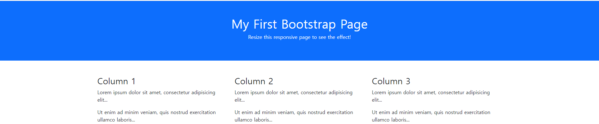

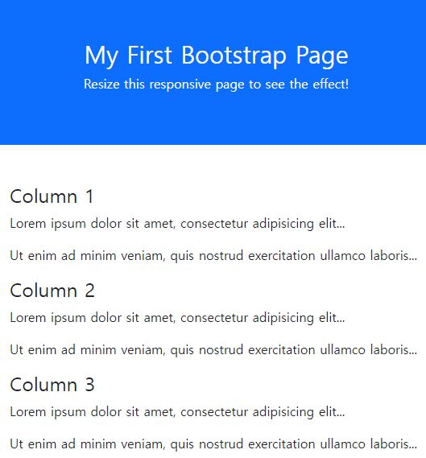

---

### (2) [Learn Responsive Design]

---

### (3) [Introduction To Responsive Web Design]

```