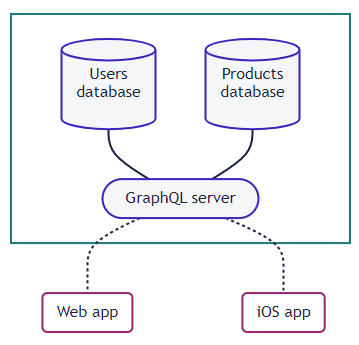
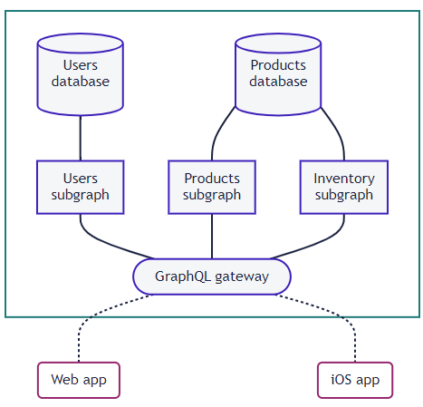

# 2. Apollo

<목차>

## (1) [Official Docs](#1-official-docshttpswwwapollographqlcomdocs)

---

### (1) [Official Docs](https://www.apollographql.com/docs/)

**Home**

- Apollo는 애플리케이션 클라이언트 (예: 웹 및 네이티브 앱)와 백엔드 서비스 간의 데이터 흐름을 관리하는 데 도움이 되는 통신 계층인 통합 슈퍼그래프를 구축하기 위한 플랫폼
- supergraph의 중심에는 GraphQL이라는 쿼리 언어 존재
- Apollo Client : GraphQL 작업을 실행하고 결과를 캐시하며 애플리케이션 상태를 관리
  - React
  - IOS
  - Kotlin
- Backend
  - Apollo Server
  - Federation
  - Router
- Cloud
  - Studio
  - Rover CLI

**The Apollo Graph Platform**

- Apollo 플랫폼은 애플리케이션이 연결된 데이터 저장소 및 외부 API의 모든 조합에서 데이터와 상호 작용할 수 있도록 하는 데이터 계층인 통합 그래프를 구축, 쿼리, 관리 및 확장할 수 있도록 지원
- 그래프는 애플리케이션 클라이언트와 백엔드 서비스 사이에 위치하여 두 서비스 간의 데이터 흐름을 촉진
- Apollo 그래프는 GraphQL을 사용하여 이 데이터 흐름의 구조를 정의하고 시행
- Build your graph with Apollo Server
  - 그래프에는 애플리케이션 클라이언트의 GraphQL 작업을 처리하는 서비스가 필요
  - 이 서비스는 백엔드 데이터 소스와 통신하여 필요에 따라 데이터를 가져오고 수정
  - 이 서비스를 구축하려면 Apollo 서버를 사용 가능
  - Apollo Server는 확장 가능한 오픈 소스 자바스크립트 그래프QL 서버
  - 이를 통해 다음을 정의 가능
    - 그래프에서 사용할 수 있는 모든 유형 및 필드를 지정하는 GraphQL 스키마
    - 백엔드 데이터 원본의 데이터로 스키마의 각 필드를 채우는 방법을 지정하는 확인자 모음
  - 모든 호스트 환경 또는 서버 없는 환경에 Apollo 서버 배포 가능
  - 다양한 인기 있는 Node.js 미들웨어를 지원하며 TypeScript와 원활하게 작동
  - Build incrementally
    - 그래프가 즉시 모든 백엔드 데이터 소스를 연결하거나 모든 클라이언트 요청을 처리할 필요는 없음
    - Apollo 그래프 플랫폼은 점진적인 채택을 지원하고 장려
    - 더 많은 데이터 소스를 연결하고 스키마를 확장하면, Apollo Server는 더 많은 비율의 클라이언트 데이터 요청을 처리 가능
    - 클라이언트는 그래프에서 아직 지원하지 않는 요청에 대해 기존 솔루션을 계속 사용할 수 있음
  - Make the jump to federation
    - 그래프의 크기와 복잡성이 커지기 시작하면 Apollo Server의 확장 라이브러리를 사용하여 그래프를 통합 가능
    - 연합 아키텍처에서 그래프의 API는 단일 서버 대신 여러 서비스에 걸쳐 구현
    - 각 서비스에는 자체 GraphQL 스키마가 있으며, 이러한 스키마는 서비스 전체에서 작업을 지능적으로 실행하는 게이트웨이에 의해 병합
- Query your graph with Apollo Client
  - 그래프의 첫 번째 버전을 배포한 후 응용 프로그램 클라이언트에서 그래프 쿼리를 시작 가능
  - 이러한 쿼리를 실행하려면 Apollo Client를 사용 가능
  - Apollo 클라이언트는 강력한 캐싱 및 상태 관리 기능을 갖춘 사용자 정의 가능한 오픈 소스 JS GraphQL 클라이언트
  - 이를 통해 개발자는 쿼리를 사용하는 UI 구성 요소 내에서 직접 쿼리를 정의하고 쿼리 결과가 도착하거나 변경될 때 해당 구성 요소를 자동으로 업데이트 가능
  - 또한 TypeScript와 원활하게 작동
  - Apollo Client의 캐시는 고객이 관심을 갖는 그래프의 일부를 로컬로 복제
  - 이렇게 하면 데이터가 이미 있는 경우 클라이언트가 자체적으로 데이터를 쿼리할 수 있으므로 불필요한 네트워크 요청을 방지하여 성능 향상
  - Supported Apollo Client platforms
    - Apollo 클라이언트는 React에 대한 공식적인 지원을 포함하며, 다른 인기 있는 뷰 레이어를 위한 커뮤니티 유지 관리 라이브러리 있음
    - Apollo 클라이언트는 iOS용 스위프트 클라이언트와 안드로이드용 자바/코틀린 클라이언트를 포함한 모바일에서도 공식적으로 지원
- Manage your graph with Apollo Studio
  - Apollo 플랫폼은 오픈 소스 라이브러리 외에도 그래프의 성능을 측정하고 안전하게 확장하는 데 도움이 되는 클라우드 호스팅된 도구 모음 제공
  - 이 도구들은 함께 Apollo Studio로 알려져 있음
  - The schema registry
    - Apollo 스키마 레지스트리는 아폴로 스튜디오를 포함한 많은 개발 도구들을 지원
    - 그래프의 스키마를 게시하면 Studio를 사용하여 스키마의 구조를 탐색하고 변경 기록을 추적하며 다른 많은 강력한 기능의 토대를 마련 가능
- Scale your graph with Apollo Federation
  - 그래프가 커짐에 따라 그래프 스키마의 고유한 부분을 소유하는 여러 GraphQL 서비스로 해당 기능을 나누는 것이 유용
  - 이렇게 하는 것은 연합 아키텍처를 채택하는 것
  - Apollo는 Apollo 연합이라 불리는 특정 연합 건축물의 규격을 정의
  - Non-federated architecture
    - 연합되지 않은 아키텍처에서 단일 GraphQL 서버는 그래프의 스키마 전체를 담당
    - 클라이언트 요청이 들어오면 서버는 직접 연결하는 하나 이상의 데이터 저장소에 있는 데이터를 가져오거나 수정하여 클라이언트 요청 해결
      
  - Apollo Federation architecture
    - Apollo 연합에서는 하나 이상의 서브그래프 앞에 게이트웨이 존재
    - 게이트웨이는 GraphQL 서버이며 각 하위 그래프도 마찬가지
    - 각 하위 그래프는 자체 스키마를 정의하고 해당 스키마의 필드를 채우는 데 필요한 데이터 저장소에 연결
    - 그런 다음 게이트웨이는 이러한 스키마를 집계하여 단일 스키마(슈퍼그래프 스키마라고 함)로 결합
    - 클라이언트 요청이 들어오면 게이트웨이는 요청된 필드가 어떤 하위 그래프에 의해 소유되는지 알 수 있음
    - 작업을 완전히 완료하는 데 필요한 하위 그래프의 조합에 걸쳐 작업을 지능적으로 실행
    - Apollo 서버에는 게이트웨이 또는 하위 그래프 역할을 할 수 있는 확장 라이브러리가 포함
    - Apollo Studio는 그래프의 가동 시간을 최대화하는 데 도움이 되는 무료 관리 페더레이션 기능을 제공
      
