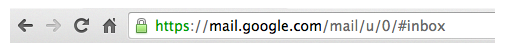

# 1. How does the internet wrok?

<목차>

(1) [The internet, explained](#1-the-internet-explainedhttpswwwvoxcom201461618076282the-internet)
(2) [How Does the Internet Work?](#2-how-does-the-internet-workhttpwebstanfordeduclassmsande91siwww-spr04readingsweek1internetwhitepaperhtm)
(3) [Introduction to Internet](#3-introduction-to-internethttpsroadmapshguideswhat-is-internet)
(4) [How does the Internet work?](#4-how-does-the-internet-workhttpswwwyoutubecomwatchvx3c1ih2njeg)
(5) [How the Internet Works in 5 Minutes](#5-how-the-internet-works-in-5-minuteshttpswwwyoutubecomwatchv7lpdttkxpc)

---

### (1) [The internet, explained](https://www.vox.com/2014/6/16/18076282/the-internet)

**What is the Internet?**

- 인터넷은 세계에서 가장 인기 있는 컴퓨터 네트워크
- 1969년 학술 연구 프로젝트에서 시작되어 1990년대에 세계적인 상업 네트워크
- 전 세계 20억 명 이상의 사람들에 의해 사용되고 있음
- 인터넷은 분리되어 있음
- 아무도 인터넷을 가지고 있거나 인터넷에 연결할 수 있는 사람을 제어하지 않음
- 대신, 수천 개의 다른 조직들이 자체 네트워크를 운영하고 자발적인 상호 연결 협정 협상
- 대부분의 사람들은 웹 브라우저를 사용하여 인터넷 콘텐츠에 접근
- 웹과 인터넷은 다른 말
- 웹은 많은 인터넷 응용 프로그램 중 하나
- 다른 인터넷 응용 프로그램으로는 이메일과 HitTorrent 존재

**Where is the internet?**

- 인터넷은 세 가지 기본적인 부분 존재
- The last mile
  - 가정과 소기업을 인터넷에 연결하는 인터넷의 일부
  - 현재, 미국의 주거용 인터넷 연결은 약 60%는 Comcast와 Time Warner와 같은 케이블 TV 회사들에 의해 제공됨
  - 나머지 40% 중, 점점 더 많은 수가 새로운 광케이블 사용, 그 중 대부분은 Verizon의 FiOS 프로그램이나 AT&T의 U-Verse의 일부분
  - 상당하지만 줄어드는 수치에서 전화 케이블을 통해 제공되는 구식 DSL 서비스를 사용
  - last mile에는 사람들이 휴대폰으로 인터넷에 접속할 수 있게 해주는 타워 포함
  - 무선 인터넷 서비스는 모든 인터넷 사용에서 차지하는 비중이 크고 증가
- Data centers
  - 사용자가 데이터를 저장하고 온라인 앱과 콘텐츠를 호스팅하는 서버로 된 것
  - 일부는 구글과 페이스북과 같은 대기업이 소유
  - 다른 것들은 더 작은 웹사이트들에 서비스를 제공하는 상업 시설들
  - Data center는 매우 빠른 인터넷 연결을 가지고 있어 많은 사용자에게 동시에 서비스 제공
  - Data center는 전 세계 어느 곳에나 위치할 수 있지만 땅과 전기가 저렴한 외딴 지역에 위치하는 경우가 많음
  - 예시로, 구글, 페이스북, 마이크로소프트는 모두 Iowa에 Data cneter를 건설
- The backbone
  - 주로 광섬유 케이블을 통해 Data center과 소비자 간에 데이터를 전송하는 장거리 네트워크로 구성
  - backbone 시장은 경재 이치열
  - backbone 제공자들은 보통 주요 도시에 위치한 인터넷 교환소에서 그들의 네트워크를 자주 연결
  - IEP에 존재감을 확립하면 backbone 제공자들이 다른 사람들과의 연결을 훨씬 쉽게 개선

**Who created the internet?**

- 인터넷은 군사고등연구계획국(ARPA, 현 ARPA)의 자금 지원을 받은 학술연구 네트워크인 APPANET으로 시작됨
- 이 프로젝트는 ARPA 관리자인 Bob Taylor 주도, 네트워크는 Bolt, Beranek and Newman 회사가 구축
- 1969년에 운행 시작
- 1973년, 소프트웨어 엔지니어 Vint Cerf와 Bob Kahn은 ARPANET의 차세대 네트워킹 표준을 연구 시작
- TCP/IP로 알려진 이러한 표준은 현대 인터넷의 기반
- 1983년 1월 1일, ARPANET은 TCP/IP를 사용하는 것으로 전환됨
- 1980년대 동안, 인터넷에 대한 자금은 군대에서 국립과학재단으로 이동
- NSF는 1981년부터 1994년까지 인터넷 중추 역할을 했던 장거리 네트워크에 자금 지원
- 1994년 Clinton 행정부는 인터넷 backbone에 대한 통제를 민간 부문에 넘김
- 그 이후 개인적으로 운영되고 자금이 지원됨

**Did Al Gore invent the internet?**

- Al Gore 전 부통령은 인터넷 발명의 공로를 자처하는 말을 자주 듣지만, 실제 그가 1999년 CNN 인터뷰에서 한 말은 '인터넷을 만드는 데 내가 주도적으로 했다'
- Gore는 이 발언으로 인해 널리 조롱
- 그러나 인터넷을 발명한 사람들, TCP/IP 디자이너 Bob Kahn과 Vint Cerf는 2000년에 Gore를 변호하는 글을 작성
- 그들은 Gore가 '인터넷의 중요성을 인식하고 인터넷의 발전을 촉진하고 지지한 최초의 정치 지도자'라고 주장
- '1970년대까지 거슬러 올라가 Gore 하원위원은 고속 통신에 대한 아이디어를 홍보'라고 두 사람은 작성
- Gore는 1991년 고성능 컴퓨팅 및 통신법을 후원했으며, Kahn과 Cerf는 '컴퓨터 과학 분야를 넘어 인터넷을 확산시키는 주요 수단 중 하나가 됨' 라고 말함

**Who runs the internet?**

- 아무도 인터넷을 운영하지 않음
- 분산된 네트워크로 구성되어 있음
- 수천 개의 기업, 대학, 정부 및 기타 실체들이 자체 네트워크를 운영하고 자발적인 상호 연결 협정을 기반으로 서로 트래픽을 교환
- 인터넷을 작동시키는 공유 기술 표준은 인터넷 기술 특별 조사단이라는 조직에 의해 관리
- IETF는 개방형 조직으로 누구나 자유롭게 회의에 참석하고, 새로운 표준을 제안하며, 기존 표준의 변경 사항을 권고 가능
- 무도 IETF가 승인한 표준을 채택할 필요는 없지만, IETF의 합의 기반 의사결정 프로세스는 IETF의 권고사항이 일반적으로 인터넷 커뮤니티에 의해 채택되도록 하는 데 도움이 됨
- 인터넷 주소 관리 협회(ICANN)는 인터넷 거버넌스를 담당하는 것으로 설명되기도 함
- ICANN은 이름에서 알 수 있듯이 도메인 이름(vox.com과 같은)과 IP 주소의 배포를 담당
- 인터넷 주소 관리 기구는 누가 인터넷에 연결할 수 있는지, 어떤 종류의 정보를 그것을 통해 보낼 수 있는지를 통제하지 않음

**What’s an IP address?**

- 인터넷 프로토콜 주소는 컴퓨터가 인터넷에서 서로를 식별하는 데 사용하는 숫자
- 예를 들어 vox.com의 IP 주소는 216.165.46.10
- 인터넷 할당 번호 기관으로 알려진 ICANN 부서는 IP 주소를 배포하여 서로 다른 두 조직이 동일한 주소를 사용하지 않도록 하는 역할

**What is IPv6?**

- IPv4로 알려진 현재의 인터넷 표준은 약 40억 개의 IP 주소만을 허용
- 1970년대에는 매우 큰 숫자로 여겨졌지만, 오늘날 IPv4 주소의 공급은 거의 다 됨
- 그래서 인터넷 기술자들은 IPv6라고 불리는 새로운 표준을 개발
- IPv6는 놀라운 수의 고유 주소(정확한 수치는 39자리 길이)를 허용하여 세계가 다시는 고갈되지 않도록 보장
- 처음에 IPv6로의 전환은 느렸음
- 이 표준에 대한 기술적인 작업은 1990년대에 완료되었지만, 인터넷 커뮤니티는 심각한 닭과 달걀 문제에 직면 : 대부분의 사람들이 IPv4를 사용하는 한, 아무도 IPv6로 전환할 동기가 거의 없었음
- 그러나 IPv4 주소가 부족해지자 IPv6 채택이 가속화
- IPv6를 통해 구글에 접속한 사용자의 비율은 2013년 초 1%에서 2015년 중반 6%로 증가

**How does wireless internet work?**

- 초창기에는 인터넷 접속이 물리적 케이블을 통해 이루어짐
- 최근에는 무선 인터넷 접속이 점점 더 보편화
- 무선 인터넷 접속에는 와이파이와 셀룰러라는 두 가지 기본 유형
- 와이파이 네트워크는 비교적 간단
- 가정이나 직장에서 인터넷 접속을 제공하기 위해 누구나 와이파이 네트워킹 장비를 구입 가능
- 와이파이 네트워크는 무면허 스펙트럼, 즉 누구나 무료로 사용할 수 있는 전자기 주파수를 사용
- 이웃의 네트워크가 서로 간섭하는 것을 방지하기 위해, 와이파이 네트워크의 전력(및 범위)에 엄격한 제한 존재
- 셀룰러 네트워크는 더 중앙 집중화
- 그들은 서비스 지역을 세포로 쪼개서 일함
- 가장 밀집된 지역에서는 셀이 단일 도시 블록만큼 작을 수 있고, 시골 지역에서는 셀의 폭이 수 마일에 달할 수 있음
- 각 셀은 중앙에 탑이 있어 그곳의 장치에 서비스를 제공
- 장치가 한 셀에서 다른 셀로 이동할 때, 네트워크는 자동으로 장치를 한 타워에서 다른 타워로 넘겨 사용자가 중단 없이 계속 통신할 수 있도록 함
- 와이파이 네트워크에서 사용하는 무면허 저전력 스펙트럼을 사용하기에는 셀이 너무 크큼
- 대신, 셀룰러 네트워크는 전용으로 허가된 주파수를 사용
- 이 스펙트럼이 부족하기 때문에 보통 경매로 낙찰
- 무선 경매는 1994년 첫 번째 경매가 열린 이후 미국 재무부에 수백억 달러의 수익 창출

**What is the cloud?**

- 클라우드는 2000년대 초반에 대중화된 컴퓨팅 접근 방식을 설명
- 서버에 파일을 저장하고 인터넷을 통해 소프트웨어를 전송함으로써 클라우드 컴퓨팅은 사용자에게 더 단순하고 안정적인 컴퓨팅 경험을 제공
- 클라우드 컴퓨팅을 통해 소비자와 기업은 컴퓨팅을 유틸리티로 취급할 수 있으며, 기술적인 세부 사항은 기술 회사에 맡기는 것
- 예를 들어, 1990년대에 많은 사람들이 문서와 스프레드시트를 편집하기 위해 마이크로소프트 오피스를 사용
- 그들은 하드 드라이브에 문서를 저장
- 그리고 새로운 버전의 마이크로소프트 오피스가 출시되었을 때, 고객들은 그것을 구입해서 PC에 수동으로 설치해야 했음
- 대조적으로, 구글 독스는 클라우드 오피스 제품군
- 사용자가 docs.google.com을 방문하면 자동으로 최신 버전의 Google 문서를 받게 됨
- 파일들은 구글의 서버에 저장되기 때문에, 그것들은 어떤 컴퓨터에서도 이용 가능
- 게다가 하드 드라이브 충돌로 인해 파일을 잃어버릴 염려도 없음 (마이크로소프트는 이제 Office 365라는 자체 클라우드 오피스 제품군을 보유하고 있음)
- Gmail과 Hotmail은 아웃룩과 같은 데스크톱 이메일 클라이언트를 대체한 클라우드 이메일 서비스
- Dropbox는 장치 간에 데이터를 자동으로 동기화하는 클라우드 컴퓨팅 서비스로, 사람들이 플로피 디스크에 파일을 휴대하지 않아도 됨
- Apple의 iCloud는 사용자의 음악 및 기타 파일을 데스크톱 컴퓨터에서 모바일 장치로 자동으로 복사하여 사용자가 USB 연결을 통해 동기화하는 번거로움을 덜어줌
- 클라우드 컴퓨팅은 기업에도 큰 영향
- 1990년대에는 웹 사이트를 만들고자 하는 기업들이 자체 서버를 구입하여 운영해야 했음
- 그러나 2006년, Amazon.com은 고객들이 시간 단위로 서버를 빌릴 수 있는 아마존 웹 서비스를 시작
- 이로 인해 웹사이트 제작에 대한 진입장벽이 낮아졌고 사이트들이 인기가 높아짐에 따라 용량을 빠르게 확장하기가 훨씬 쉬워짐

**What is a packet?**

- 패킷은 인터넷을 통해 전송되는 정보의 기본 단위
- 정보를 소화가 잘 되는 작은 조각으로 나누면 네트워크의 용량이 더 효율적으로 사용 가능
- 패킷은 두 부분으로 나뉨
- 헤더에는 패킷 길이, 소스 및 대상, 수신자가 전송 중 패킷 손상 여부를 탐지하는 데 도움이 되는 체크섬 값 등 패킷이 대상에 도달하는 데 도움이 되는 정보가 포함
- 헤더 뒤에 실제 데이터가 나옴
- 패킷은 최대 64 킬로바이트의 데이터를 포함할 수 있으며, 이는 대략 20페이지의 일반 텍스트
- 만약 인터넷 라우터가 혼잡이나 다른 기술적인 문제를 겪는다면, 그들은 단순히 패킷을 버림으로써 그것을 처리 가능
- 패킷이 대상에 도달하지 않은 것을 감지하고 다른 복사본을 보내는 것은 전송 컴퓨터의 책임
- 이 접근법은 직관에 반하는 것처럼 보일 수 있지만, 인터넷의 핵심 인프라를 단순화하여 더 낮은 비용으로 더 높은 성능

**What is the World Wide Web?**

- 월드 와이드 웹은 인터넷에 정보를 게시하는 인기 있는 방법
- 이 웹은 1991년 유럽 과학 연구 단체 CERN의 컴퓨터 프로그래머인 Timothy Berners-Lee가 만들었음
- 그것은 다른 인터넷 애플리케이션보다 더 강력하고 사용자 친화적인 인터페이스를 제공
- 웹은 하이퍼링크를 지원하여 사용자가 한 문서에서 다른 문서로 클릭 한 번으로 탐색할 수 있게 함
- 시간이 지남에 따라 웹은 이미지, 오디오, 비디오 및 대화형 콘텐츠를 지원하면서 점점 더 정교해짐
- 1990년대 중반, 야후와 Amazon.com과 같은 회사들은 웹을 기반으로 수익성 있는 사업을 구축 시작
- 2000년대에 야후 지도와 구글 독스와 같은 완전한 기능을 갖춘 웹 기반 응용 프로그램이 만들어짐
- 1994년 버너스리는 월드 와이드 웹 컨소시엄(W3C)을 설립하여 웹의 공식 표준 조직이 있었음
- 여전히 W3C의 이사이며 웹 표준의 개발을 계속 감독하고 있음 그러나, - 웹은 개방형 플랫폼이며, W3C는 누구에게도 권고안을 채택하도록 강요할 수 없음
- 실제로 웹에 가장 큰 영향을 미치는 조직은 마이크로소프트, 구글, 애플, 그리고 선도적인 웹 브라우저를 생산하는 모질라가 존재

**What’s a web browser?**

- 웹 브라우저는 사용자들이 웹사이트를 다운로드하고 볼 수 있게 해주는 컴퓨터 프로그램
- 웹 브라우저는 데스크톱 컴퓨터, 태블릿 및 휴대 전화에 사용 가능
- 최초로 널리 사용된 브라우저는 일리노이 대학의 연구자들에 의해 만들어진 Mosaic 였음
- Mosaic 팀은 1994년에 상업적으로 성공한 최초의 웹 브라우저를 만든 넷스케이프를 설립하기 위해 캘리포니아로 이동했음
- 넷스케이프의 인기는 곧 마이크로소프트의 인터넷 익스플로러에 의해 가려졌지만 넷스케이프의 브라우저의 오픈 소스 버전은 현대의 파이어폭스 브라우저가 됨
- 애플은 2003년에 사파리 브라우저를 출시했고 구글은 2008년에 크롬이라고 불리는 브라우저를 출시
- 2015년까지 크롬은 약 50%의 시장 점유율로 가장 인기 있는 웹 브라우저로 성장
- 인터넷 익스플로러, 파이어폭스, 사파리도 상당한 시장 점유율을 기록했다.

**What is SSL?**

- Secure Sockets Layer의 줄임말인 SSL은 웹 사용자가 인터넷을 통해 전송하는 정보의 개인 정보를 보호할 수 있도록 하는 암호화 기술 제품군
- Gmail.com과 같은 보안 웹 사이트를 방문하면 URL 옆에 사이트와의 통신이 암호화되어 있음을 나타내는 잠금이 표시
- Gmail.com과 같은 보안 웹 사이트를 방문하면 URL 옆에 사이트와의 통신이 암호화되어 있음을 나타내는 잠금이 표시
  
- 그 자물쇠는 제 3자가 당신이 보내거나 받은 어떤 정보도 읽을 수 없다는 것을 의미
- 후드에서 SSL은 데이터를 수신자만 해독할 수 있는 암호화된 메시지로 변환함으로써 이를 달성
- 만약 악의적인 당사자가 대화를 듣는다면, 그것은 이메일, 페이스북 게시물, 신용카드 번호 또는 다른 개인 정보의 내용이 아닌, 겉보기에는 무작위로 보이는 일련의 문자만 보게 될 것임
- SSL은 1994년 넷스케이프에 의해 도입
- 초창기에는 온라인 뱅킹 사이트와 같은 몇 가지 유형의 웹 사이트에서만 사용됨
- 2010년대 초까지, 구글, 야후, 페이스북은 모두 그들의 웹사이트와 온라인 서비스에 SSL 암호화를 사용
- 보다 최근에는 SSL의 사용을 보편화하려는 움직임이 있음
- 2015년, 모질라는 파이어폭스 브라우저의 향후 버전이 SSL 암호화 부족을 보안 결함으로 취급할 것이라고 발표
- 구글도 크롬과 같은 수순을 밟는 방안을 검토 중

**What is the Domain Name System?**

- DNS(Domain Name System)는 216.1994.46.10과 같이 검색하기 어려운 숫자 주소 대신 브라우저에 vox.com을 입력하여 Vox에 액세스할 수 있는 이유
- DNS 시스템은 계층적
- 예를 들어 .com 도메인은 Verisign이라는 회사에서 관리
- Verisign은 google.com 및 vox.com과 같은 하위 코드를 할당
- 이러한 2단계 도메인의 소유자는 mail.google.com 및 maps.google.com과 같은 하위 도메인을 만들 수 있음
- 인기 있는 웹사이트는 도메인 이름을 사용하여 대중에게 자신을 식별하기 때문에 DNS의 보안은 점점 더 큰 문제
- 범죄자들과 정부 스파이들 모두 facebook.com과 gmail.com과 같은 인기 있는 웹사이트를 사칭하고 그들의 사적인 통신을 가로채기 위해 DNS를 손상시키려고 노력
- DNSSEC라는 표준은 암호화를 통해 DNS 보안을 강화하려고 하지만, 그것을 채택한 사람은 거의 없음

**Who decides what domain names exist and who gets them?**

- 도메인 네임 시스템은 캘리포니아에 기반을 둔 비영리 단체인 ICANN(Internet Corporation for Assigned Names and Numbers)에 의해 관리
- 인터넷 주소 관리 기구는 1998년에 설립
- 미국 상무부로부터 DNS에 대한 권한을 부여받았지만, 미국 정부로부터 독립성을 점점 더 주장
- 도메인 이름에는 두 가지 유형
- 첫 번째는 .com, .edu, .org, .gov와 같은 일반적인 최상위 도메인
- 인터넷이 미국에서 시작되었기 때문에, 이 도메인들은 미국에서 가장 인기 있는 경향
- 이러한 도메인에 대한 권한은 일반적으로 민간 조직에 위임
- 국가 코드 최상위 도메인(ccTLD)도 있음
- 세계의 각 나라는 고유의 2글자 코드를 가지고 있음
- 예를 들어, 미국의 ccTLD는 .us, 영국의 ccTLD는 .uk, 중국의 ccn
- 이러한 도메인은 각 국가의 당국에 의해 관리
- .tv(섬나라 투발루)와 .io(영국령 인도양 준주)와 같은 일부 ccTLD는 본국 밖에서 사용할 수 있도록 인기를 끌고 있음
- 2011년에 인터넷 주소 관리 기구는 새로운 gTLD를 더 쉽게 만들도록 투표
- 그 결과, 향후 몇 년 동안 수십 개 또는 수백 개의 새로운 도메인이 생길 수 있음

### (2) [How Does the Internet Work?](http://web.stanford.edu/class/msande91si/www-spr04/readings/week1/InternetWhitepaper.htm)

### (3) [Introduction to Internet](https://roadmap.sh/guides/what-is-internet)

### (4) [How does the Internet work?](https://www.youtube.com/watch?v=x3c1ih2NJEg)

### (5) [How the Internet Works in 5 Minutes](https://www.youtube.com/watch?v=7_LPdttKXPc)
