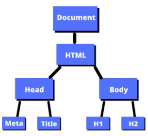
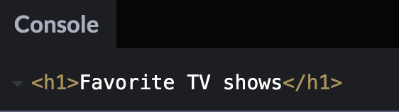
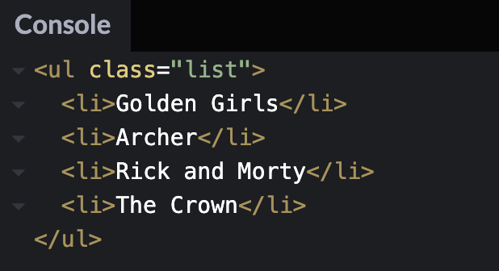
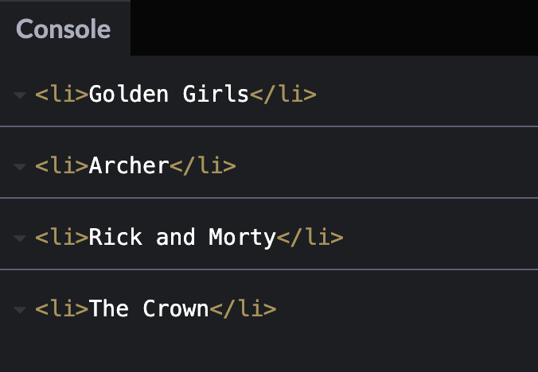
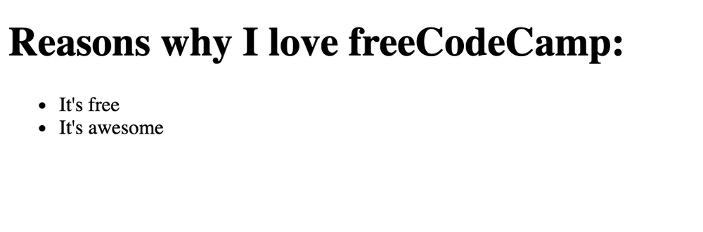
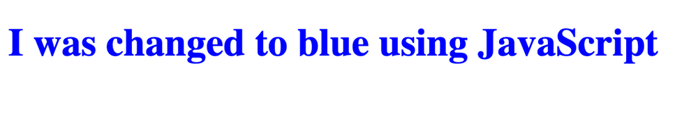

# 2. Learn DOM Manipulation

<목차>

## (1) [What is the DOM?](#1-what-is-the-domhttpswwwfreecodecamporgnewswhat-is-the-dom-document-object-model-meaning-in-javascript)

## (2) [JavaScript HTML DOM](#2-javascript-html-domhttpswwww3schoolscomjsjshtmldomasp)

## (3) [The Box Model]

## (4) [The CSS Display Property]

---

### (1) [What is the DOM?](https://www.freecodecamp.org/news/what-is-the-dom-document-object-model-meaning-in-javascript/)

**What is the DOM?**

- DOM은 문서 객체 모델을 의미
- 문서에서 요소를 생성, 변경 또는 제거할 수 있는 프로그래밍 인터페이스
- 이러한 요소에 이벤트를 추가하여 페이지를 보다 동적으로 만들기도 가능
- DOM은 HTML 문서를 노드 트리로 확인, 노드는 HTML 요소

```
<!DOCTYPE html>
<html lang="en">
  <head>
    <meta charset="UTF-8" />
    <meta name="viewport" content="width=device-width, initial-scale=1.0" />
    <meta http-equiv="X-UA-Compatible" content="ie=edge" />
    <title>DOM tree structure</title>
  </head>
  <body>
    <h1>DOM tree structure</h1>
    <h2>Learn about the DOM</h2>
  </body>
</html>
```

- 루트 노드라고 하며 `<html>` 요소인 하나의 자식 노드 포함
- `<html>` 요소에는 `<head>`와 `<body>` 요소 두 개의 자식 노드
- `<head>`와 `<body>` 요소에는 모두 고유한 자식



- 문서에서 이러한 요소에 접근하고 JS를 이용하여 변경 가능

**How to Select Elements in the Document**

- HTML 문서에서 요소를 선택하는 방법

  - `getElementById()`
  - `querySelector()`
  - `querySelectorAll()`

- `getElementById()`

  - HTML에서 `id`는 HTML 요소의 고유 식별자로 사용
  - `id`는 두 개의 다른 요소에 대해 동일한 이름을 가질 수 없음

    ```
    <p id="para1">This is my first paragraph.</p>
    <p id="para2">This is my second paragraph.</p>
    ```

  - JS에서 이름을 참조하여 HTML 태그를 가져올 수 있음
    `document.getElementById("id name goes here")`

- `querySelector()`

  - 하나 이상의 CSS 선택기가 있는 요소를 찾을 수 있음

  ```
  <h1>Favorite TV shows</h1>
  <ul class="list">
      <li>Golden Girls</li>
      <li>Archer</li>
      <li>Rick and Morty</li>
      <li>The Crown</li>
  </ul>
  ```

  ```
  const h1Element = document.querySelector("h1");
  console.log(h1Element);
  ```

  

  - `list` 클래스 이름을 대상으로 하도록 하는 방법

  ```
  const list = document.querySelector(".list");
  console.log(list);
  ```

  

- `querySelector()`

  - CSS 선택기와 일치하는 모든 요소를 ​​찾고 해당 노드의 목록을 모두 반환
  - 모든 `<li>` 항목을 찾고 싶다면 `>` 자식 결합자를 사용하여 모든 자식을 찾을 수 있음

  ```
  const listItems = document.querySelectorAll("ul > li");
  console.log(listItems);
  ```

  

  - 실제 값까지 하려면 NodeList를 반복하고 각 항목을 `forEach()` 이용

  ```
  const listItems = document.querySelectorAll("ul > li");

  listItems.forEach((item) => {
  console.log(item);
  });
  ```

  

**How to Add New Elements to the Document**

- `document.createElement()`를 이용하여 DOM 트리에 새 요소 추가 가능
- 다음과 같이 `<h1>` 태그만 존재

```
<h1>Reasons why I love freeCodeCamp:</h1>
```

- `<ul>` 요소를 변수에 할당

```
let unorderedList = document.createElement("ul");
```

- `<ul>`에 `appendChild()`를 통해 해당 요소를 문서에 추가

```
document.body.appendChild(unorderedList);
```

- `createElement()`를 통해 `<ul>`안에 `<li>` 요소 추가

```
let listItem1 = document.createElement("li");
let listItem2 = document.createElement("li");
```

- `textContent`를 통하여 lsit 아이템 추가 및 `appendChild()`를 통해 list를 추가

```
let listItem1 = document.createElement("li");
listItem1.textContent = "It's free";
unorderedList.appendChild(listItem1);

let listItem2 = document.createElement("li");
listItem2.textContent = "It's awesome";
unorderedList.appendChild(listItem2);
```

- 다음은 전체 코드

```
let unorderedList = document.createElement("ul");
document.body.appendChild(unorderedList);

let listItem1 = document.createElement("li");
listItem1.textContent = "It's free";
unorderedList.appendChild(listItem1);

let listItem2 = document.createElement("li");
listItem2.textContent = "It's awesome";
unorderedList.appendChild(listItem2);
```



**How to Use the Style Property to Change Inline CSS Styles**

- `style` 속성은 HTML의 CSS를 바꿀 수 있음

```
<h1>I was changed to blue using JavaScript</h1>
```

- `querySelector()`를 통해 `h1` 태그를 가져오고 `h1.style.color`를 통해 글자색 변경

```
const h1 = document.querySelector("h1");
h1.style.color = "blue";
```



**How to Use addEventListener() to Listen for Events on the Page**

- 버튼과 같은 HTML 요소에 이벤트 추가 가능
- 버튼을 클릭하면 경고 메시지 팝업

```
<button id="btn">Show alert</button>
```

- `getElementById()` 메서드를 사용하고 변수에 할당하여 JS에서 해당 요소를 대상으로 지정 가능

```
const button = document.getElementById("btn");
```

- `addEventListener()` 통해 유형과 함수를 통해 `click`을 추가하고 경고 메시지 발생시킴

```
button.addEventListener("click", () => {
  alert("Thank you for clicking me");
});
```

**Conclusion**

- DOM은 Document Object Model의 약자이며 문서에서 요소를 생성, 변경 또는 제거할 수 있는 프로그래밍 인터페이스
- 이러한 요소에 이벤트를 추가하여 페이지를 보다 동적으로 만들기 가능
- `getElementById()`, `querySelector()`, `querySelectorAll()` 같은 메소드를 사용하여 JavaScript에서 요소 선택 가능
- `document.createElement()`를 통해 문서에 새 요소를 추가 가능
- `style` 속성 을 사용하여 요소의 인라인 CSS 스타일을 변경 가능
- `addEventListener()`을 통해 버튼과 같은 요소에 이벤트를 추가

---

## (2) [JavaScript HTML DOM](https://www.w3schools.com/js/js_htmldom.asp)

**JavaScript HTML DOM**

- The HTML DOM (Document Object Model)
  - 웹 페이지가 로드 되면 브라우저 는 페이지의 문서 객체 모델 생성
  - HTML DOM 모델은 Objects 트리로 구성
    
  - 객체 모델을 통해 JavaScript는 동적 HTML을 생성하는 데 필요한 모든 기능을 얻기 가능
    - JavaScript는 페이지의 모든 HTML 요소를 변경 가능
    - JavaScript는 페이지의 모든 HTML 속성을 변경 가능
    - JavaScript는 페이지의 모든 CSS 스타일을 변경 가능
    - JavaScript는 기존 HTML 요소 및 속성을 제거 가능
    - JavaScript는 새로운 HTML 요소와 속성을 추가 가능
    - JavaScript는 페이지의 모든 기존 HTML 이벤트에 반응 가능
    - JavaScript는 페이지에서 새로운 HTML 이벤트를 생성 가능
- What is the DOM?
  - DOM은 W3C(World Wide Web Consortium) 표준
  - DOM은 문서 액세스 표준을 정의
  - "W3C DOM(문서 개체 모델)은 프로그램과 스크립트가 문서의 내용, 구조 및 스타일에 동적으로 액세스하고 업데이트할 수 있도록 하는 플랫폼 및 언어 중립적 인터페이스"
  - W3C DOM 표준은 세 부분으로 구분
    - Core DOM : 모든 문서 유형에 대한 표준 모델
    - XML DOM : XML ​​문서의 표준 모델
    - HTML DOM : HTML 문서의 표준 모델
- What is the HTML DOM?
  - HTML DOM은 HTML용 표준 개체 모델 및 프로그래밍 인터페이스
    - HTML 요소를 객체
    - 모든 HTML 요소 의 속성
    - 모든 HTML 요소에 액세스 하는 방법
    - 모든 HTML 요소에 대한 이벤트
  - 즉 , HTML DOM은 HTML 요소를 가져오고, 변경하고, 추가하거나 삭제하는 방법에 대한 표준
